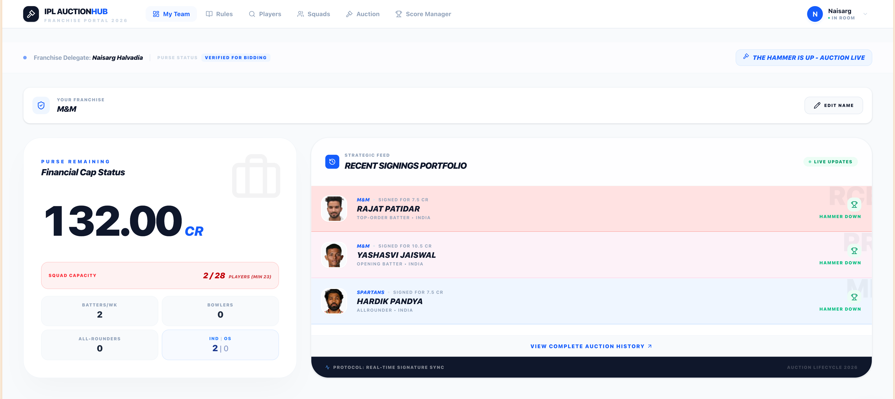
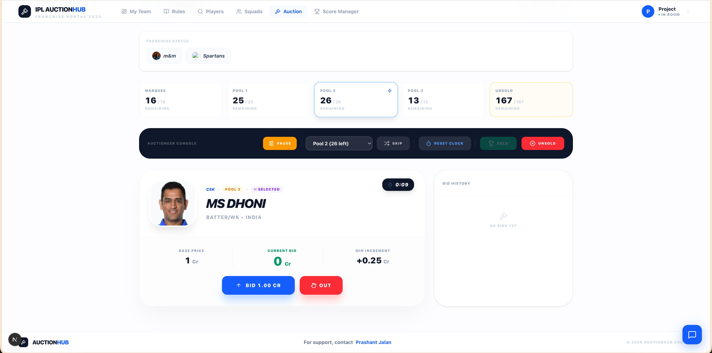
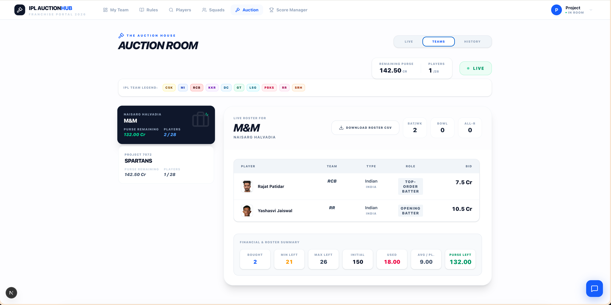
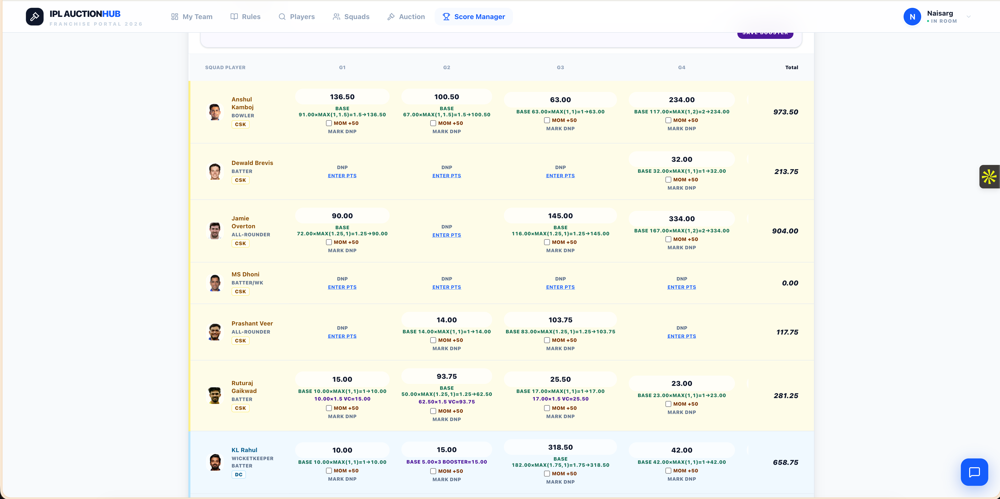
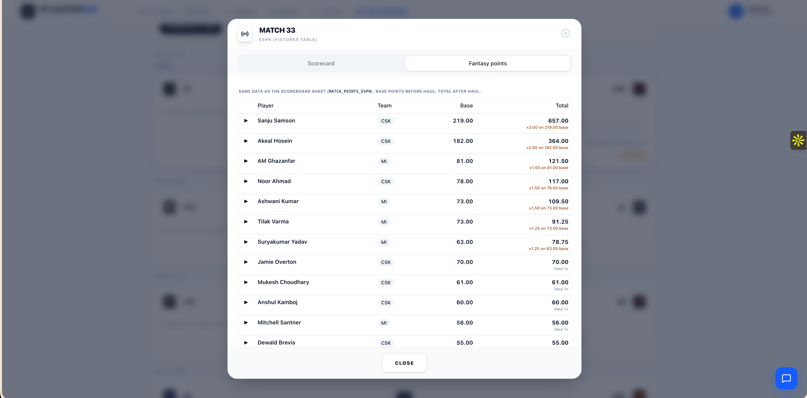
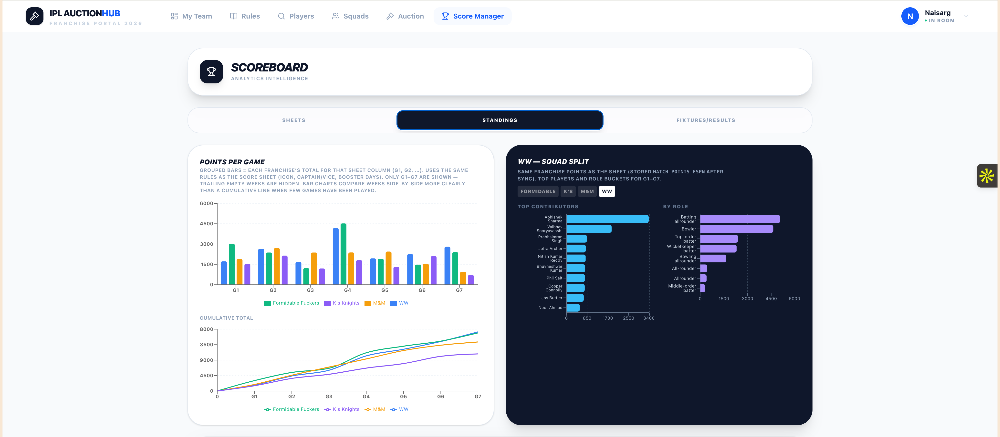

# IPL 2026 Auction Hub

Private league web app for an **IPL-style fantasy auction**, **rosters**, **rules**, and **match scoring** in one place—so your group can get off the shared spreadsheet and still keep house rules and the auction room aligned.

---

## Product walkthrough (with screenshots)

This is the real user story from login to standings, using the screenshots in `public/screenshots/`.

### 1) Login and access control


The journey starts on the sign-in page. Users can authenticate with Google OAuth or email/password (Supabase Auth).  
After login, profile + role resolution determines what they can do:
- **Admin**: controls auction flow, role changes, and score operations
- **Participant**: bids and manages team-facing actions
- **Viewer**: read-only league visibility

### 2) Dashboard (team command center)



After login, users land on a franchise dashboard showing:
- current purse and squad capacity
- recent signings feed
- live auction context and quick navigation

This is the “operating console” for each team during the auction phase.

### 3) Auction room (live bidding)




The live auction screen handles:
- pool-by-pool bidding (Marquee / Pool 1 / Pool 2 / Pool 3 / Unsold)
- auctioneer controls (pause, next, sold/unsold, pool switch)
- bid timeline and realtime updates

Realtime sync is backed by Supabase channels (`postgres_changes` + broadcast/presence patterns), while critical validations are enforced in DB logic where configured.

### 4) Team audit inside auction (roster verification while auction is on)



The Teams tab inside the auction lets organizers and franchises verify:
- who bought which player
- remaining purse and squad counts
- role composition and roster summary

This prevents drift between live bids and final squad state.

### 5) Score Manager once matches begin



When matchdays begin, the Score Manager becomes the operations area for points:
- player-by-player game columns
- editable / reviewable scoring cells
- total rollups per player/franchise

### 6) ESPN scraper output + points calculation review



This modal-style review layer shows parsed match/player rows and fantasy point totals.  
Current process:
- upstream data is pulled using CricAPI/ESPN-related flows (see scripts/workflows)
- points are computed and written to DB
- admins review and can manually correct where needed

Important: squad/player intake and score ingestion should not be treated as blindly authoritative from upstream payloads. Manual validation remains part of the current operating process.

### 7) Standings and analytics



Final output for league users is the standings analytics view:
- points-per-game and cumulative progression
- squad split and role contribution analysis
- fixtures/results context for decision making

---

## Automation and deployment flow (GitHub Actions)

This project is wired to GitHub Actions for recurring operations and operator-triggered runs.

### Workflows in this repo

- `.github/workflows/cricapi-scorecard-sync.yml`
  - Scheduled cron runs (twice daily)
  - Also supports manual `workflow_dispatch` with inputs (e.g. backfill date, fixture populate toggle)
- `.github/workflows/espn-scraper.yml`
  - Scheduled scraper run
  - Manual trigger with options (`date_ist`, `clear_day`)
- `.github/workflows/main.yml`
  - Daily Supabase backup + email delivery
  - Manual trigger supported

### How to run jobs

You have two options:

1. **Manual trigger (button click)**  
   Go to **GitHub → Actions → select workflow → Run workflow** and pass inputs when needed.

2. **Automated schedule (cron)**  
   Workflows run automatically based on cron expressions already defined in each YAML.

So yes: clicking buttons can trigger these pipelines instantly, and the same pipelines can run fully automated on cron.

---

## What it does

- **Auth:** Email/password (Supabase Auth) and **Google OAuth**; password reset via email; profiles bootstrap on first sign-in (roles can be guided by env).
- **Roles:** Admin, Participant, and Viewer—admins manage auction flow and can adjust roles where RLS allows.
- **Auction:** Pools (e.g. Marquee → Unsold), live bidding over **Supabase Realtime**, bid history, sold/unsold flow, purse and squad limits enforced in the database (RPC) where implemented.
- **League data:** Player registry, squads, optional rules editor, auction history.
- **Season:** Fixtures/score ingestion (CricAPI primary, ESPN paths where used), scoreboard and points workflows for your league.
- **Squad ingestion (current):** Initial squads are curated from ESPNcricinfo-backed payloads via internal API/script flows, then verified manually before finalizing in DB.
- **Automation:** TypeScript and Python scripts; optional GitHub Actions for scheduled sync (see `.github/workflows` if present).

---

## Tech stack

| Area | Choice |
|------|--------|
| App | **Next.js** (App Router), **React 19**, **TypeScript** |
| UI | **Tailwind CSS**, shared UI primitives, **Lucide** icons |
| Backend | **Supabase** (PostgreSQL, Auth, Realtime, RLS) |
| Charts | **Recharts** |
| Tooling | **Node.js ≥ 20** (`package.json` → `engines`) |

---

## Quick start

```bash
git clone <your-repo-url>
cd Typescript
npm install
# Create .env in the project root (see Environment variables below)
npm run dev
```

Open [http://localhost:3000](http://localhost:3000).

**Production build**

```bash
npm run build
npm start
```

---

## Environment variables

Create **`.env`** in the project root. Do not commit secrets.

### App (browser + server)

| Variable | Purpose |
|----------|---------|
| `NEXT_PUBLIC_SUPABASE_URL` | Supabase project URL |
| `NEXT_PUBLIC_SUPABASE_ANON_KEY` | Public anon key (RLS still applies) |
| `NEXT_PUBLIC_ADMIN_EMAIL` | *(Optional)* Email that receives **Admin** when a profile is first created client-side (defaults exist in code; override for your league) |

**OAuth:** Configure **Google** (and email provider settings) in the **Supabase Dashboard** → Authentication → Providers—not via `NEXT_PUBLIC_GOOGLE_*` in this repo.

### Scripts & CI (server-side only)

| Variable | Purpose |
|----------|---------|
| `SUPABASE_SERVICE_ROLE_KEY` | Service role for scripts / APIs that must bypass RLS—**never** expose to the client |
| `CRICAPI_KEY` / `NEXT_PUBLIC_CRICAPI_KEY` | CricAPI where used |
| Other script-specific keys | See `scripts/` and `grep` for `process.env` / `os.getenv` |

---

## Useful npm scripts

| Command | Purpose |
|---------|---------|
| `npm run dev` | Development server |
| `npm run build` / `npm start` | Production build & serve |
| `npm run lint` | ESLint |
| `npm run sync:fixtures` | Fixture sync helper (`scripts/sync-fixtures.ts`) |
| `npm run sync:auto` | Auto score sync entry (`scripts/auto-sync-scores.ts`) |
| `npm run sync:espn-points-db` | ESPN-related DB sync (`scripts/sync_match_points_espn_from_db.ts`) |

Python utilities live under `scripts/`; prefer running them locally or via CI with the same env names documented in each script.

---

## Repository layout (high level)

```
app/                  Next.js routes (auction, dashboard, scoreboard, …)
components/           React components (auth, layout, chat, …)
lib/                  Supabase clients, helpers
supabase/migrations/  PostgreSQL migrations (apply via Supabase CLI or dashboard)
database/             Manual SQL ops — see database/README.md
scripts/              TS/Python automation
```

---

## Database

- **Migrations:** `supabase/migrations/` — apply with your Supabase workflow.
- **Ad-hoc SQL** (auction reset, admin trigger helpers): **[database/README.md](./database/README.md)**.

League-specific seed data is not assumed to be in git; coordinate with your maintainer for how to populate a fresh project.

### Create database from scratch (recommended flow)

Use this when setting up a brand-new Supabase project for this app.

1. Create a new Supabase project and copy:
   - `NEXT_PUBLIC_SUPABASE_URL`
   - `NEXT_PUBLIC_SUPABASE_ANON_KEY`
   - `SUPABASE_SERVICE_ROLE_KEY` (for scripts/server only)
2. Add env vars in local `.env` and in your deployment platform.
3. Log in with Supabase CLI and link project:

```bash
supabase login
supabase link --project-ref <your-project-ref>
```

4. Apply migrations in order:

```bash
supabase db push
```

Notes:
- Migration filenames are prefixed with `stepNN` to make order explicit (for example `..._step01_...` → `..._step25_...`).
- If you apply manually in SQL editor, run them in filename order.

5. Configure Auth providers in Supabase Dashboard:
   - Email/password
   - Google OAuth (if needed)
6. Create at least one admin user:
   - Set `NEXT_PUBLIC_ADMIN_EMAIL` before first login for auto-admin bootstrap, or
   - Update role in `profiles` after first sign-in.
7. Optional reset helpers:
   - Use SQL files in `database/sql/` (see `database/README.md`) to reset auction runtime state or reapply admin trigger logic.

### Foolproof DB setup (exact files + exact order)

If someone is setting this up from zero, use this sequence exactly.

#### Option A (recommended): Supabase CLI applies all migrations

This is the safest approach because it applies every file in `supabase/migrations/` in order.

```bash
supabase login
supabase link --project-ref <your-project-ref>
supabase db push
```

That command applies all files, including:
- `20260312151439_step01_init_from_prod.sql`
- ...
- `20260422223000_step25_harden_bidding_and_sale_rpcs.sql`

#### Option B: Manual SQL execution (if CLI is unavailable)

Run migration files in lexicographic filename order (which now matches step order):

```bash
ls -1 supabase/migrations/*.sql | sort
```

Then execute each file sequentially against your target DB.

#### Minimum tables you should see after setup

After migrations succeed, verify these core tables exist:
- `profiles`
- `players`
- `bids`
- `auction_state`
- `auction_config`
- `fixtures` / `fixtures_cricapi` (depending on migration path used)
- match-points related tables (used by Score Manager / standings flows)

Quick verification query:

```sql
select table_name
from information_schema.tables
where table_schema = 'public'
order by table_name;
```

If these are missing, migrations were not fully applied.

### Squad source and manual step (current state)

- Squad/player intake currently uses ESPNcricinfo-related API payload flows in `scripts/` and app APIs as a source input, then a manual validation pass before lock-in.
- Do not treat upstream payloads as blindly authoritative; validate player mappings and roles before publishing to auction pools.
- Planned improvement: CSV import for squads (future).  
  For now, squad correction is a manual step via scripts/SQL/admin UI.

---

## Auction & realtime (short version)

The auction room subscribes to a **Supabase Realtime** channel. **Postgres changes** (e.g. `bids`, `auction_state`, `players`) drive shared state after commits; **broadcast** messages handle quick UI coordination (e.g. timer hints, bidding locks); **presence** can reflect who is connected. **Authoritative state lives in PostgreSQL**; critical actions should go through **RLS-safe** tables and **RPC** functions where you have deployed them.

For a deeper narrative (WAL, channel names, OAuth details), see **git history** of this README or inline comments in `app/auction/page.tsx`.

---

## Third-party data & disclaimer

Not affiliated with the IPL, BCCI, or commercial fantasy operators. Respect API and site **terms**, **rate limits**, and **robots** guidance. Thanks to data and tooling providers you configure (e.g. **CricAPI**, **ESPNcricinfo** for fallback/verification, **Playwright** where used, **GitHub Actions** for schedules).

---

## Contributing

Issues and PRs welcome if the repo is shared. For private league forks, coordinate with the maintainer.

---

## License

If no `LICENSE` file is present in the repo, treat the project as **all rights reserved** until the authors add one.

---

## App demo (end-to-end feel)

This short demo captures the live nature of the platform and how the product feels in action during auction flow.


---

*Built for friends who want auction night and season scoring in one honest place—IPL 2026 and beyond.*
