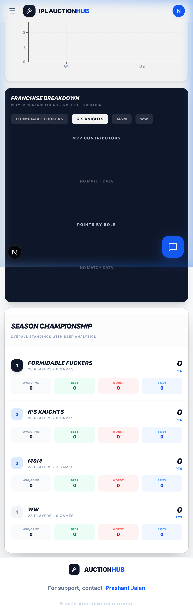
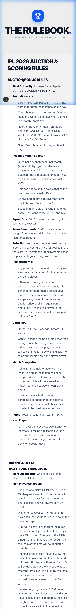

# IPL 2026 Auction Hub & Score Manager

A real-time auction platform and analytical dashboard designed for precision fantasy cricket management. This system integrates a live bidding engine with an automated scoring pipeline to provide a seamless experience from the initial player draft to the final match of the season.

---

## ── Real-Time Auction Engine ──

The core of the platform is a high-performance auction room that handles multi-user bidding with millisecond latency. It ensures financial integrity across all franchises while managing the complex state of a massive player pool.

*   **Dynamic Bidding**: Real-time competition using Supabase Broadcast for zero-latency bid updates.
*   **Budget Integrity**: Automated math that prevents teams from overspending, factoring in minimum squad requirements and remaining "purse" in real-time.
*   **Squad Management**: Immediate sold/passed status updates across the global player registry.

---

## ── Automated Scoring Pipeline ──

Beyond the auction, the platform transforms into a sophisticated Score Manager. We use a database-first approach to minimize external API costs while maintaining data freshness.

*   **GitHub Actions Automation**: 2x daily automated sync scripts (7:30 PM & 11:30 PM IST) fetch raw scorecard data from CricAPI and update the central database.
*   **Manual Override System**: A robust bulk-save pipeline for manual point entry, featuring "dirty state" visual indicators (yellow highlights) and atomic upserts to ensure data consistency.
*   **Standardized Point Engine**: Automatic calculation of batting, bowling, and fielding points based on predefined tournament rules.

---

## ── Analytical Insights ──

The Standings dashboard provides deep-dive visualizations using Recharts to help franchises understand their progress and roster composition.

*   **Points Progression**: Area charts showing cumulative score growth across all games.
*   **Head-to-Head Comparison**: Bar charts for direct performance benchmarking between franchises.
*   **Franchise Breakdown**: Donut and Pie charts visualizing:
    *   **MVP Contributors**: Which top 5 players are carrying the team's score.
    *   **Points by Role**: Distribution of points across Batters, Bowlers, WKs, and All-Rounders.

---

## ── Fixtures & Match Management ──

Our fixtures module stays in sync with the live season, providing users with a clear roadmap of upcoming games and historical results.

*   **Match Awareness**: High-level "Today" visibility and "Points update near [Time]" logic to keep users informed of when data freshing will occur.
*   **Player Points Verifier**: A direct audit tool for each match that allows admins to cross-reference every point distributed against the raw API scorecard.

---

## ── Technical Architecture ──

*   **Frontend**: Next.js 15 (App Router)
*   **Styling**: Tailwind CSS & Lucide React
*   **Database & Auth**: Supabase (PostgreSQL, Real-time, RLS)
*   **Charts**: Recharts (Custom SVG wrappers)
*   **Automation**: GitHub Actions (Node.js runtime)
*   **External Data**: CricAPI v1 (Scorecard JSONB)

---

## ── Project Setup ──

To run the project locally, ensure you have Node.js 20+ installed.

1.  Clone the repository.
2.  Install dependencies: `npm install`
3.  Set up your `.env` file with Supabase and CricAPI credentials.
4.  Run the development server: `npm run dev`
5.  Access the dashboard at `http://localhost:3000`.

---
© 2026 AuctionHub Council. Built for performance, accuracy, and competition.
